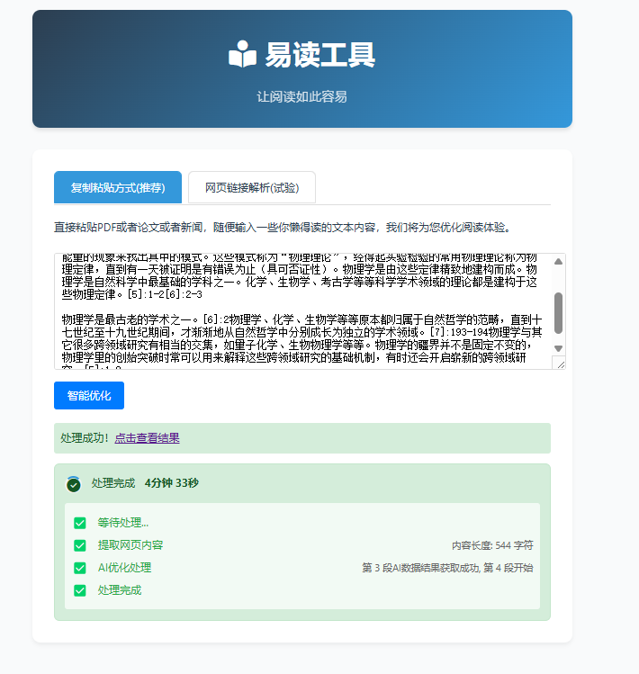
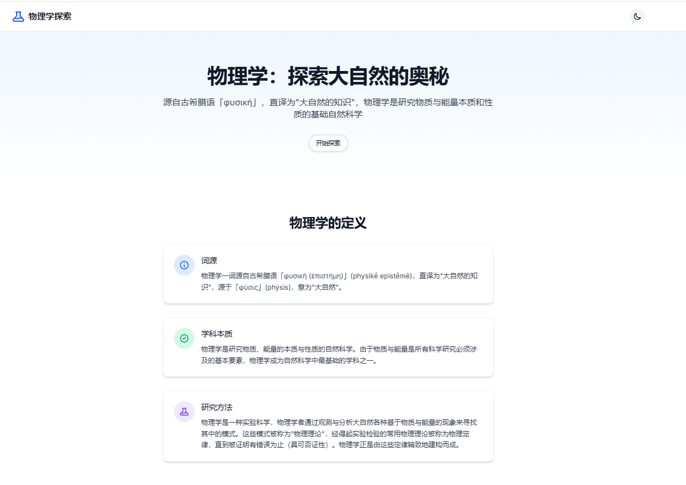

# 易读 (Easy Reading)

一个智能网页内容提取和优化工具，让阅读变得更轻松。
用AI把PDF一键变成能玩的可视化网页，这不比PPT酷多了?

灵感来源是:
数字生命卡兹克[用AI把PDF一键变成能玩的可视化网页，这不比PPT酷多了?](https://mp.weixin.qq.com/s/JVxbbkR587_Mxpu02k29Kw)


UI:

优化结果:


## 功能特点

### 1. 内容处理
- 支持 直接文本 和 网页 URL 输入两种模式
- 智能提取网页主要内容，过滤广告和无关信息
- 使用 Claude 3.7 AI 进行内容优化和重组
- 多轮处理确保内容质量

### 2. 用户界面
- 简洁现代的响应式设计
- 实时处理状态显示
- 处理进度可视化
- 支持以下处理状态展示：
  - 等待处理
  - 内容提取（显示字符数）
  - AI 处理（显示处理轮次）
  - 完成状态（显示总用时）

### 3. 技术特性
- 异步处理支持
- 服务器发送事件（SSE）实时状态更新
- 自动重试机制
- 错误处理和状态恢复
- SSL 证书验证配置选项

## 技术栈

### 后端
- FastAPI
- Python 3.8+
- OpenAI兼容接口 Claude 3.7+ AI API
- BeautifulSoup4（网页解析）

### 前端
- 原生 JavaScript
- Font Awesome 图标
- CSS3 动画效果

## 快速开始


首先:
1. `git clone https://github.com/dalerkd/EasyAIReading`
2. `复制 .env copy.example成 .env`
3. 配置 .env里的服务器和KEY成你自己的(必须是OpenAI兼容服务器)

这里提供3种启动方式:

### 1. Windows快捷启动玩法
直接运行
`启动易度服务.bat`
访问 `http://localhost:8000` 开始使用

### 2. Docker启动玩法
使用Docker的方法：

1. **日常启动**：
```bash
docker-compose up -d
```

2. **查看运行状态**：
```bash
docker-compose ps
```

3. **修改代码后重新部署**：
```bash
# 停止当前容器
docker-compose down

# 重新构建并启动
docker-compose up -d --build
```

4. **修改.env配置**：
```bash
# 直接修改.env文件后重启容器
docker-compose restart
```

5. **查看日志**：
```bash
docker-compose logs -f
```

6. **停止服务**：
```bash
docker-compose down
```

### 3. 手工启动
1. 克隆项目并安装依赖：
```bash
git clone https://github.com/dalerkd/EasyAIReading
cd EasyAIReading
pip install -r requirements.txt
```

2. 配置环境变量：
```bash
cp .env.example .env
# 编辑 .env 文件，填入必要的配置信息
```

3. 启动服务：
```bash
python main.py
```
或
```bash
uvicorn main:app --reload
```


4. 访问 http://localhost:8000 开始使用

5. 经典处理时间
文字越长越复杂，时间会增加一些.

极端例子:待优化内容长度: 24,361 字符时，大约需要10段请求,总用时约800秒.取决于你的AI服务器速度.

### 4. K8s集群

```
docker build -t yidu:latest .

# 假设使用 Docker Hub，需要先给镜像打标签，本地执行直接忽略这两条
docker tag yidu:latest <your-registry>/yidu:latest
docker push <your-registry>/yidu:latest

kubectl apply -f k8s/deployment.yaml
kubectl get pods
kubectl get services
```


## 测试用例
python -m unittest tests/test_merge_responses.py -v

## 使用说明

1. 选择输入模式：
   - 网页链接：直接输入要处理的网页 URL
   - 文本输入：粘贴需要优化的文本内容

2. 点击"处理"按钮开始内容优化

3. 处理过程中可以看到：
   - 实时处理状态
   - 内容长度信息
   - AI 处理轮次
   - 总处理时间

4. 处理完成后可以：
   - 查看优化后的内容
   - 获取处理结果的永久链接

## 注意事项

1. 网页处理可能受目标网站反爬虫策略影响
2. 建议合理设置超时时间，避免长时间等待
3. 如遇到 SSL 证书问题，可在配置中禁用验证
4. AI 处理时间与内容长度成正比


## 难点:
### 场景1：如果长度超过一次返回的内容，则AI需要多次返回  [X]
### 场景2: AI生成的多轮内容可能存在重叠   [X]
### 场景3: 有一定AI生成的 JS CSS云端链接是错误的   [X]


## 开发计划
- [ ] 完善网页链接解析,添加更多内容源支持
目前因为还是试验状态,会被很多站点拦截,或者无法获取到JS渲染后的内容
- [X] docker化
- [ ] 优化网页历史查看,及可能为优化后生成更好的名字?
- [ ] 服务化,支持登录

## 许可证

本项目采用 Apache License 2.0 许可证。

Copyright 2025 dalerkd

Licensed under the Apache License, Version 2.0 (the "License");
you may not use this file except in compliance with the License.
You may obtain a copy of the License at

    http://www.apache.org/licenses/LICENSE-2.0

Unless required by applicable law or agreed to in writing, software
distributed under the License is distributed on an "AS IS" BASIS,
WITHOUT WARRANTIES OR CONDITIONS OF ANY KIND, either express or implied.
See the License for the specific language governing permissions and
limitations under the License. 
